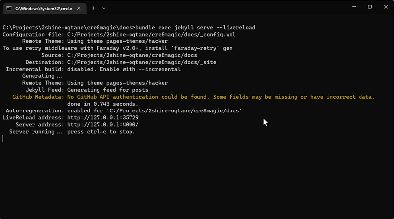

# Documentation is hosted with GitHub Pages

Public documentation: [https://cre8magic.blazor-cms.org](https://cre8magic.blazor-cms.org)

GitHub Pages are powered by [Jekyll](https://jekyllrb.com/).

Documentation use GitHub Pages supported theme: [Hacker](https://github.com/pages-themes/hacker).

## Prerequisites

- [Install Ruby and Jekyll](https://jekyllrb.com/docs/installation/)
    - Download and install a Ruby+Devkit version from RubyInstaller Downloads, eg. `rubyinstaller-devkit-2.7.6-1-x64.exe` (or `winget install -e --id RubyInstallerTeam.RubyWithDevKit.2.7`, `ridk install`).
        - use default options for installation
        - in last step, choose option [3] `MSYS2 and MINGW development tool chain`
        - `gem install jekyll bundler`

## Initial setup

- `git clone https://github.com/2sic/cre8magic.git`
- `cd cre8magic/docs`
- `bundle install`

## How to build jekyll locally?

- `bundle exec jekyll serve --livereload`

  

- browse [http://127.0.0.1:4000/](http://127.0.0.1:4000/)

## More info

- [Setting up a GitHub Pages site with Jekyll](https://docs.github.com/en/pages/setting-up-a-github-pages-site-with-jekyll)
