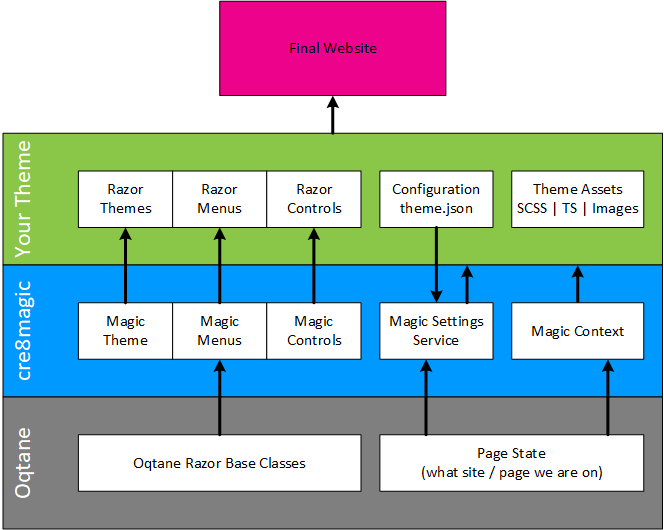
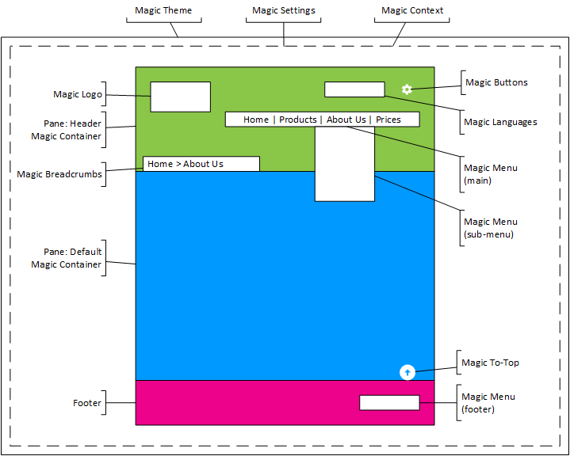

# cre8magic for Oqtane – Professional Theme Design

> &nbsp;
>
> 🪄🪄🪄 Create Magic / Stunning / Amazing Designs on Oqtane 🪄🪄🪄
>
> &nbsp;

[Oqtane](https://www.oqtane.org/) is a Blazor based platform to create awesome solutions.
It is heavily inspired by the Site/Page/Module model used in DNN.
So it's almost ready to create awesome websites and CMS solutions.

But there are two missing pieces (☮️) to create amazing websites:

1. Real Content-Management features - which can be done with the extension [2sxc](https://2sxc.org)
1. Tools to make designing themes fast and professional - enter: **cre8magic**

## cre8magic makes Oqtane Designer-Friendly

As a designer, you need certain tools and workflows to be efficient, such as:

1. the ability to make a small change and then reload the page to see the result
1. the need to focus on the **what** (like the design), without wasting time
    on the **how** (like C# code to create the menu)
1. the ability to create variations of your work, such as other layouts which
    are similar
1. every tool you add (such as cre8magic) should help, but never restrict

These aspects are important for the productivity of every designer.
Now if you've worked with Oqtane (or Blazor for that matter) you will quickly
  see that this is not possible.
This means you can whatever you want, but there is a **lot of code** involved,
  and a **lot of time-consuming restarts**.

> cre8magic takes care of all these problems 🚀
>
> cre8magic combines very simple Razor and lets you do everything through settings.

Most layouts have very similar HTML, but do vary a bit.
For example, it could have different CSS classes to give it the look you need
or a different logo file.

> imagine tweaking this at runtime (without compiling) 😏

## Overview

This is how cre8magic enhances Oqtane so that your Theme can focus on the design:

The resulting page will usually have something like this:

>
> 👉🏾 [Discover how it works](./how-it-works.md)
>

## See a Working Example and Get Started

Since this is a library, just reading the docs won't cut it.
It's best to see this in action on a real-life example.
Try the ToShine Theme Template, it will make things much easier to understand.

👉🏼 See [2shine Theme Template](https://github.com/2sic/oqtane-theme-2shine-bs5)

👉🏼 See [Get Started](./get-started.md)

## What's in the Magic Box

1. **Magic Settings**: A Settings / Configuration System
    👉🏾 see [Magic Settings](./magic-settings.md)
    👉🏾 see [Settings JSON file](./theme-json.md)
    👉🏾 see [JSON schema](./schemas/2022-10/theme.json)

1. [Magic Context](./magic-context.md)

1. [Magic Values, Classes and more](./magic-values.md)

1. [Magic Tokens](./magic-tokens.md)

1. [Magic Languages](./magic-languages.md)

1. [Magic Menu](./magic-menu.md)

1. **Magic Razor Base Classes**
  _These are the important base classes which your Razor files will inherit.
  All have in common, that they know about the theme-wide `Settings` and
  provide helper methods to get things done easily and quickly,
   with as little code as possible._
    * Theme / Container Level Base Classes
        1. `MagicTheme` - the foundation for Themes
        1. `MagicContainer` - the foundation for Containers
    * Important Base Controls / Components
        1. `MagicLanguages` is the base for the languages menu
        1. `MagicBreadcrumbs` is the base for the breadcrumbs
        1. `MagicMenuRoot` is the base for menu entry point, loading the configuration, nodes etc.
        1. `MagicMenuBase` is the base for each menu type, like _Horizontal_, _Vertical_, _Mobile_, ...
        1. `MagicLogin` is the base for login/logout icons and texts
    * Generic Base Controls / Base Components
      _These are meant for any other custom controls that you have._
        1. `MagicControl` is for razor controls that has the Octane API (it inherits from `ThemeControlBase`)
        1. `MagicComponent` is for razor controls with just the basic Razor API (inherits from `ComponentBase`)

1. **Magic Razor Controls / Components**
  _These are standalone controls for you to use, which you will normally just use but not inherit, as they already have their HTML output or something._
  _Anything we refer to as a `Control` inherits from the Oqtane `ThemeControlBase`, while things we refer to as a `Component` inherit from the .net `ComponentBase`._
    * Functional Controls / Components
        1. `MagicOqtaneControlPanel` a control which adds the main control panel for admins
        1. `MagicContextAndSettings` a wrapper used in every theme to ensure [MagicContext](./magic-context.md) and [MagicSettings](./magic-settings.md) work
    * Debug and Error Handling
        1. `MagicExceptions` a control showing important errors to admins
        1. `MagicMenuDebug` a debug helper to see what configuration a menu has and why
        1. `MagicLanguagesDebug` a debug helper to see what configuration the laguages have
        1. `MagicThemeDebug` debug helper to see all the current settings on this theme
